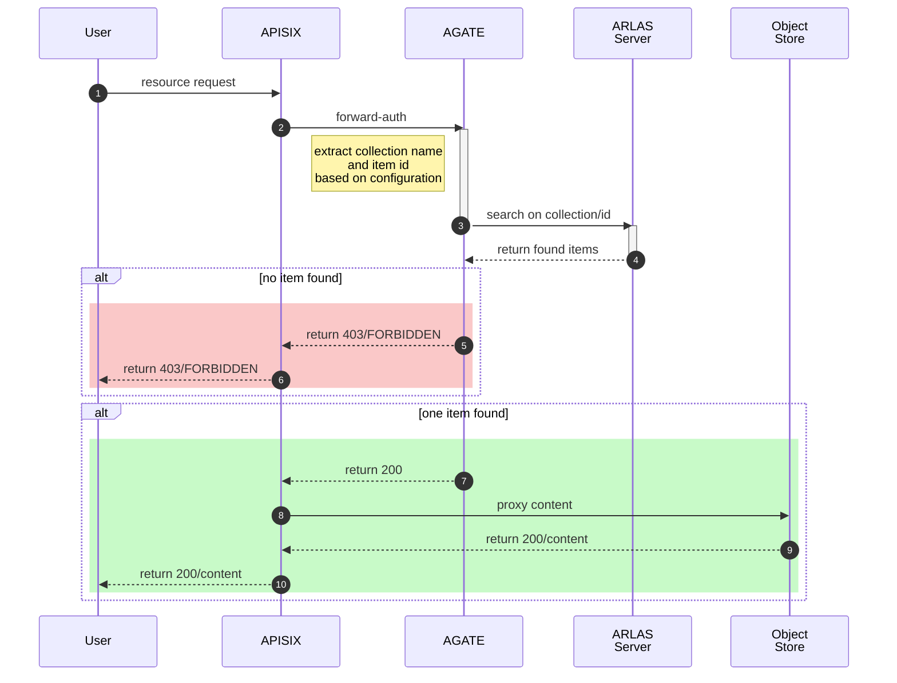

# AGATE

AGATE helps to protect resources hosted by HTTP(S) services, such as an endpoint serving an object store. It must be used as a [forward authorization](https://apisix.apache.org/docs/apisix/plugins/forward-auth/) service for APISIX. 

AGATE allows an access to a resource if the user is allowed to see the corresponding item in ARLAS. To find the corresponding item, AGATE extracts the collection name and the item id from the resource url. In other word, AGATE authorizes a request on a resource if 

- a collection name is found in the resource path
- an item identifier is found in the resource path
- a search on ARLAS Server with the user's token on the found collection name and found item id returns an item

## Configuration

### Configuring AGATE

A configuration per service must be provided. A service configuration provides:
- a list of `url_patterns` to extract the collection name and the item id. At least one is needed.
- a list of `url_patterns` for public resources: if matching, then AGATE authorizes the access
- a `pattern_target` for telling AGATE where to look:
    - if undefined, then the pattern is matched against the path
    - if `query.{param}` then the `{param}`* query parameter is used
    - if `query.{param}.url.path` then the path contained in the `{param}`* query parameter is used
    - if `query.{param}.url.query` then the query contained in the `{param}`* query parameter is used


*change `{param}` with the parameter name of your choice.

For instance, to protect the access on asset files from airs, the pattern is:
```
(/collections/)(?P<collection>[^/]+)/items/(?P<item>[^/]+)/assets/(?P<asset>[^/]+)
```
And use the following pattern to make the thumbnails public:
```
(/collections/)(?P<collection>[^/]+)/items/(?P<item>[^/]+)/assets/thumbnail
```

The configuration can also specify the header AGATE must use to find the requested URI with `url_header`. APISIX uses `X-Forwarded-Uri`.
For AGATE, requested URIs all start with the same prefix for a given service. The prefix must be configured in `url_header_prefix`.

For more details, see the [AGATE API documentation](agate_api.md)

### Configuring APISIX

Below is an APIXSIX configuration example to protect assets served by `myservice`:
```yaml
routes:
 -
    uri: /myservice/*
    methods: ["GET"]
    upstream:
      nodes:
        "minio:9000": 1
    plugins:
      forward-auth:
        uri: http://agate:8004/agate/authorization/myservice
        request_headers: ["Authorization", "arlas-org-filter"]
```

Note the headers `Authorization` and `arlas-org-filter`: AGATE includes them in ARLAS Server requests.


## Sequence description
When APISIX receives an incoming request matching a forward-auth on AGATE (e.g. `myservice`), it requests the service `/agate/authorization/myservice` on AGATE. 

The request contains 3 important headers: `Authorization`, `arlas-org-filter` and `X-Forwarded-Uri`. The last one is used to extract the collection name and the item id. AGATE makes an ARLAS Server search request along with the two first headers.

If ARLAS Server does not return any hit, then AGATE returns the 403 status code and APISIX refuses the access to the requested resource.

If ARLAS Server returns a hit, this means that the item is "visible" to the user, AGATE returns the 200 status code and APISIX proxies the requested content.


