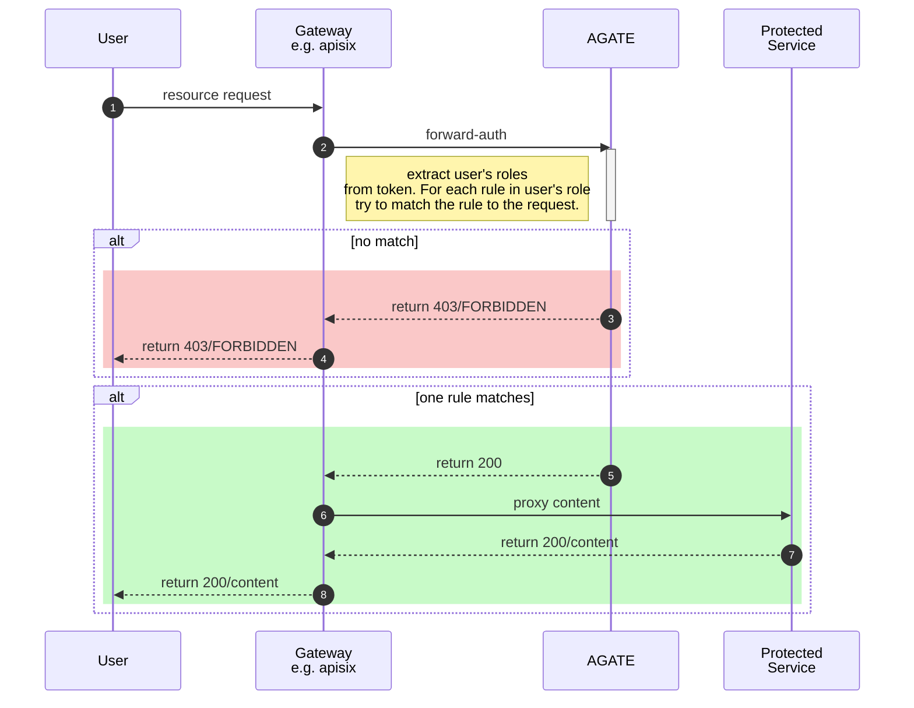
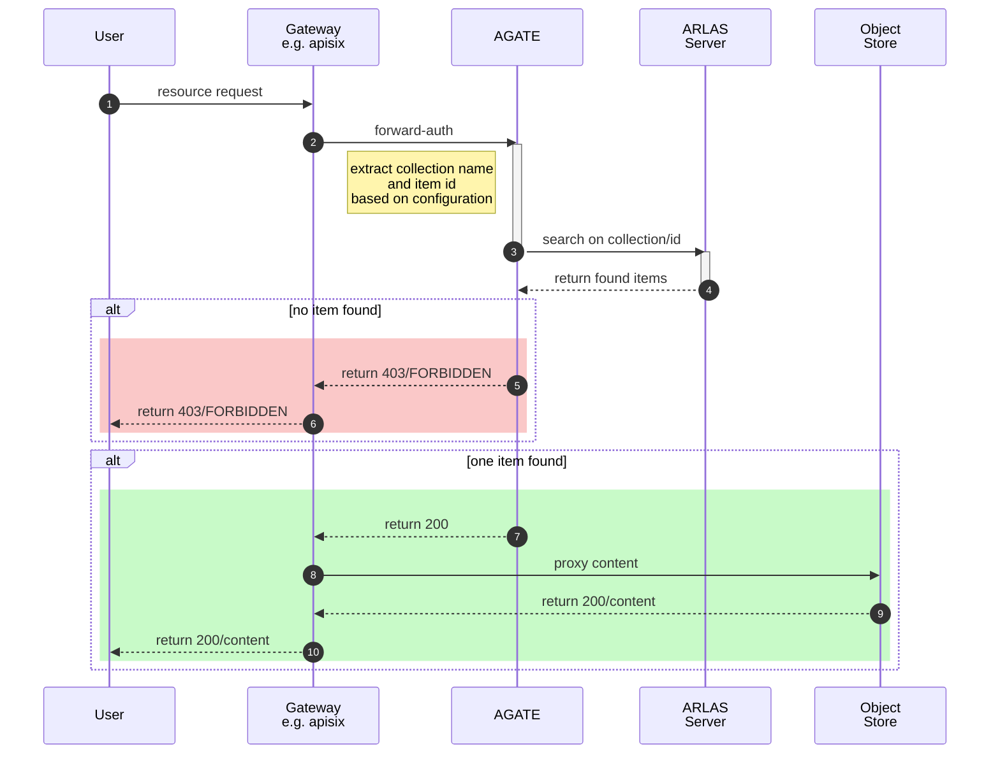

# AGATE

AGATE helps to protect resources hosted by HTTP(S) services, such as an endpoint serving an object store. It must be used as a [forward authorization](https://apisix.apache.org/docs/apisix/plugins/forward-auth/) service for the gateway (e.g. APISIX). 

AGATE can be used to protect two types of resource:
- __role protected URLs__: HTTP requests with a path and a method allowed by rules defined within roles
- __item-based assets__: URLs linked to an item and containing the name of the collection and the ID of the item, such as an image

AGATE's __item-based assets__ mecanism allows an access to a resource if the user is allowed to see the corresponding item in ARLAS. To find the corresponding item, AGATE extracts the collection name and the item id from the resource url. In other word, AGATE authorizes a request on a resource if:

- a collection name is found in the resource path
- an item identifier is found in the resource path
- a search on ARLAS Server with the user's token on the found collection name and found item id returns an item

AGATE's __role protected urls__ allows a protected request only if the path matches a pattern and if the request method matches the allowed method. The pattern and methods are modeled as rules listed in a configuration file. Rules are grouped in roles. For that reason, we call it URL Role Based Access Control (URBAC). The roles listed in the jwt token of the request are used.

## Configuration

### Configuring AGATE's Role protected URLs

The configuration of the URL Role Based Access Control (URBAC) contains:
- the path to the role file: the listing of the roles->rules->path/method. See the [roles configuration documentation](../roles) for more details. 
- the headers to use for retrieving the token and the url (jwks_uri) for validating the jwt token

### Configuring AGATE's Item based assets

A configuration per service must be provided. A service configuration provides:

- a list of `url_patterns` to extract the collection name and the item id. At least one is needed.
- a list of `public_url_patterns` for public resources: if matching, then AGATE authorizes the access
- a `pattern_target` to tell AGATE where to look:
    - if undefined, then the pattern is matched against the path
    - if `query.{param}` then the `{param}`* query parameter is used
    - if `query.{param}.url.path` then the path contained in the `{param}`* query parameter is used
    - if `query.{param}.url.query` then the query contained in the `{param}`* query parameter is used

*change `{param}` with the parameter name of your choice.

For instance, to protect the access on asset files from airs, the pattern is:
```
(/collections/)(?P<collection>[^/]+)/items/(?P<item>[^/]+)/assets/(?P<asset>[^/]+)
```
And use the following pattern to make the thumbnails public:
```
(/collections/)(?P<collection>[^/]+)/items/(?P<item>[^/]+)/assets/thumbnail
```

The following configuration protects the access cog visualization with titiler. This way, only COGs linked to items the user sees can be visualized.

```yaml
  cog:
    jwt_name: authorization
    jwt_location:
      - headers
      - query_params
    private:
      - pattern: (/airs-storage/)(?P<collection>[^/]+)/items/(?P<item>[^/]+)/assets/(?P<asset>[^/]+)
        part: query.url.url.path # takes the query parametters, use it as a url, then extract the path
```

The configuration can also specify the header AGATE must use to find the requested URI with `url_header`. APISIX uses `X-Forwarded-Uri`.


For more details, see the [AGATE API documentation](agate_api.md)

### Configuring APISIX

Below is an APIXSIX configuration example to protect assets served by `myservice`:
```yaml
routes:
 -
    uri: /myservice/*
    methods: ["GET"]
    upstream:
      nodes:
        "minio:9000": 1
    plugins:
      forward-auth:
        uri: http://agate:8004/agate/authorization/myservice
        request_headers: ["Authorization", "arlas-org-filter"]
```

Note the headers `Authorization` and `arlas-org-filter` are required: AGATE includes them in ARLAS Server requests so that it can determine the identity of the user.

## Sequence description

### Role protected URLs


```mermaid
sequenceDiagram
    autonumber
    participant US  as User
    participant AX as Gateway <br>e.g. apisix
    participant AG as AGATE
    participant AS as Protected<br>Service

    US->>AX: resource request
    AX->>AG: forward-auth
    activate AG
    Note left of AG: extract user's roles<br> from token. For each rule in user's role<br> try to match the rule to the request.
    deactivate AG
    alt no match
        rect rgb(250, 200, 200)
        AG-->>AX: return 403/FORBIDDEN
        AX-->>US: return 403/FORBIDDEN
        end
    end
    alt one rule matches
        rect rgb(200, 250, 200)
        AG-->>AX: return 200
        AX->>AS: proxy content
        AS-->>AX: return 200/content
        AX-->>US: return 200/content
        end
    end
```

### Item based assets

When APISIX receives an incoming request matching a forward-auth on AGATE (e.g. `myservice`), it requests the service `/agate/authorization/myservice` on AGATE. 

The request contains 3 important headers: `Authorization`, `arlas-org-filter` and `X-Forwarded-Uri`. The last one is used to extract the collection name and the item id. AGATE makes an ARLAS Server search request along with the two first headers.

If ARLAS Server does not return any hit, then AGATE returns the 403 status code and APISIX refuses the access to the requested resource.

If ARLAS Server returns a hit, this means that the item is "visible" to the user, AGATE returns the 200 status code and APISIX proxies the requested content.


```mermaid
sequenceDiagram
    autonumber
    participant US  as User
    participant AX as Gateway <br>e.g. apisix
    participant AG as AGATE
    participant AS as ARLAS<br>Server
    participant OS  as Object<br>Store

    US->>AX: resource request
    AX->>AG: forward-auth
    activate AG
    Note left of AG: extract collection name<br> and item id<br>based on configuration
    AG->>AS: search on collection/id
    deactivate AG
    activate AS
    AS-->>AG: return found items
    deactivate AS
    alt no item found
        rect rgb(250, 200, 200)
        AG-->>AX: return 403/FORBIDDEN
        AX-->>US: return 403/FORBIDDEN
        end
    end
    alt one item found
        rect rgb(200, 250, 200)
        AG-->>AX: return 200
        AX->>OS: proxy content
        OS-->>AX: return 200/content
        AX-->>US: return 200/content
        end
    end
```

